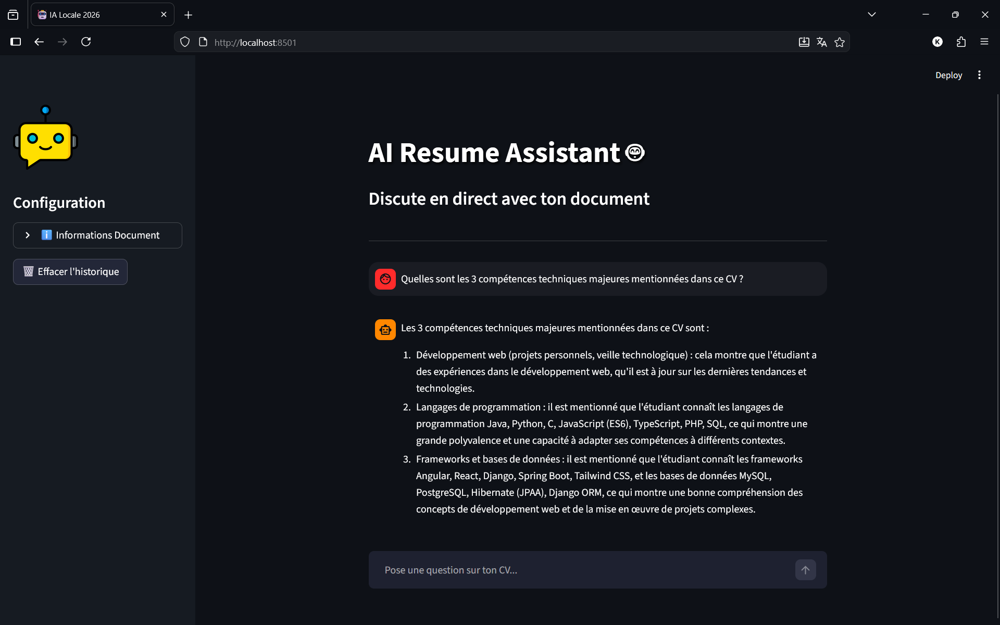

# 🤖 Local-RAG Resume Assistant (Privacy-First)


Ce projet est un assistant IA conversationnel basé sur l'architecture **RAG (Retrieval-Augmented Generation)**. Il permet d'interroger un CV (ou tout document PDF) de manière totalement locale, garantissant une confidentialité absolue des données.


## ✨ Fonctionnalités
- **Confidentialité totale** : Aucun transfert de données vers le cloud (OpenAI/Google). Tout tourne sur votre machine.
- **Performance locale** : Utilisation de modèles optimisés pour le matériel grand public.
- **Interface Intuitive** : UI moderne développée avec Streamlit, incluant un historique de chat.
- **Recherche Sémantique** : Indexation vectorielle précise avec FAISS.

## 🛠️ Stack Technique
- **LLM :** Llama 3 (via [Ollama](https://ollama.com/))
- **Embeddings :** nomic-embed-text
- **Orchestrateur :** LangChain (Core & Classic)
- **Base de données vectorielle :** FAISS
- **Frontend :** Streamlit
- **Langage :** Python 3.13+

## ⚙️ Installation et Configuration

### 1. Prérequis
- Installer [Ollama](https://ollama.com/)
- Télécharger les modèles nécessaires :
  ```bash
  ollama pull llama3
  ollama pull nomic-embed-text
